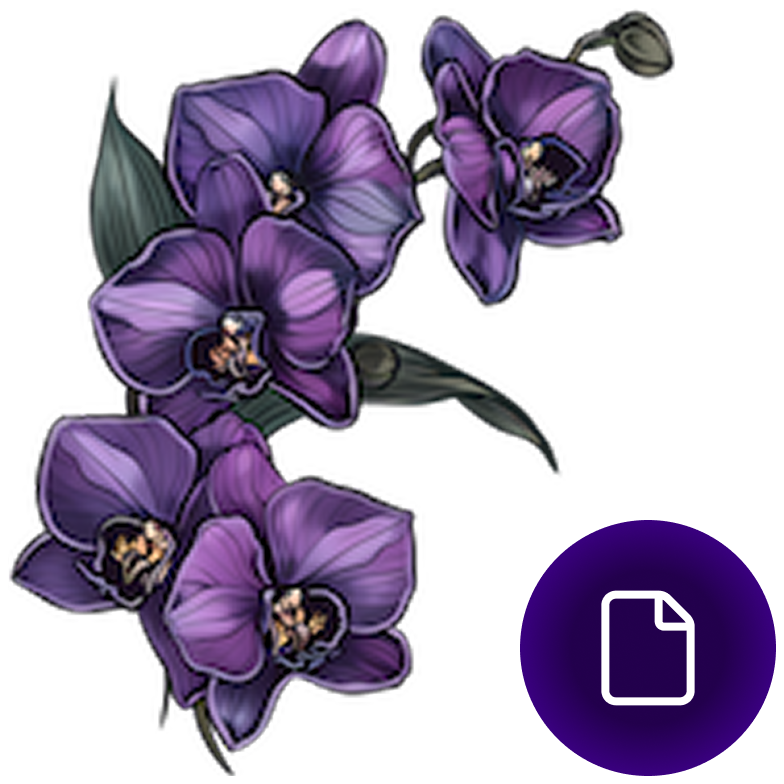
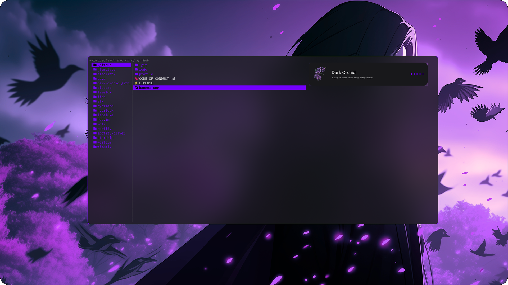

  
  <h1>Dark Orchid for {{replace}}</h1>

  A {{replace}} Theme, that's purple.

  *If you like this project, consider giving it a ⭐ to show your support!* 
  *It also helps others to discover it.*

  
  
  
  

## About
The Dark Orchid Theme is a cohesive visual ecosystem built around the striking color purple.

Centered on the rich Dark Orchid shade, it highlights purple's depth, creativity, and elegance. Through balanced contrasts and unified tones, the theme creates a bold yet harmonious aesthetic that stands out across any design.

## Features
{{replace}}

## Usage
{{replace}}

## Configuration
{{replace}}

## License
The MIT License (MIT) - Please have a look at the [LICENSE file](./LICENSE) for more details.

## Contributing
Contributions are always welcome and greatly appreciated. Whether you want to report a bug, suggest a new feature, or improve the documentation, your input helps make the project better for everyone.

Feel free to submit a pull request, issue or feature request.

### Issues and Feature Requests
Reporting an issue or creating a feature request is made by creating a new issue on this repository.

You can create a [new issue or feature request here](../../issues/new/choose).

### Pull Requests
GitHub offers a solid guideline for contributing to open source projects through pull requests, covering key practices. These best practices provide a reliable starting point for making effective contributions.

You can find the [guidelines here](https://docs.github.com/get-started/exploring-projects-on-github/contributing-to-a-project).

### Code Of Conduct
We are committed to keeping a welcoming, inclusive, and respectful community for everyone. To help us achieve this, we kindly ask that you adhere to our [Code of Conduct](./CODE_OF_CONDUCT.md).

## Legal

All trademarks and registered trademarks mentioned are property of their respective owners and are used for identification purposes only. Use of these names does not imply endorsement or affiliation.

This project is a trademark of Dark Orchid. The License does not grant rights to use the trademark without permission.

© 2025 — present by The Dark Orchid Maintainers
